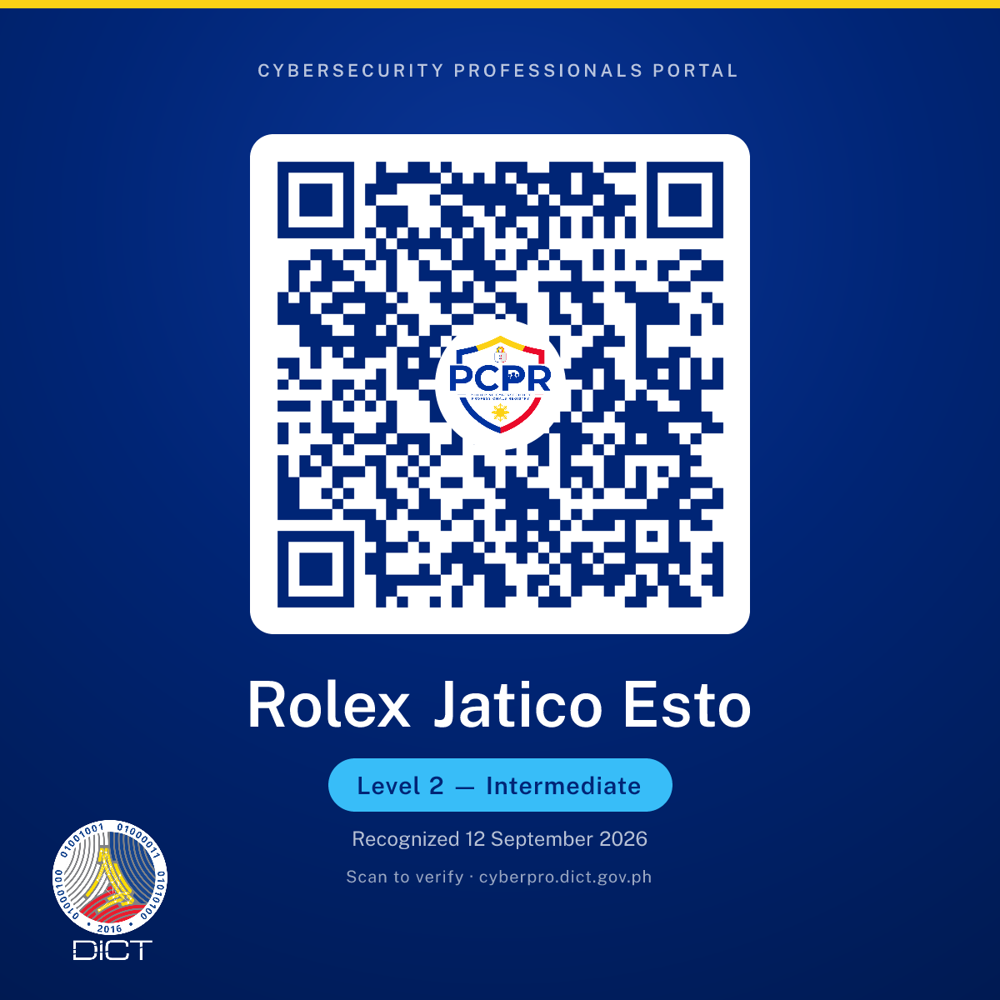

<h1 align="center">Rolex J. Esto</h1>

  <strong>Software • AI • Data • Cloud</strong>

  4th-year BSIT student building practical, production-ready solutions across
  software, AI, data, and cloud technologies.

  
  
  

 About Me

I'm a 4th-year Bachelor of Science in Information Technology student at STI College Fairview, a Data Innovation Fellow at Eskwelabs (Cohort 11), and a DICT-Recognized Cybersecurity Professional — Level 2 (Intermediate). I focus on building practical, production-ready solutions across software, AI, data, and cloud technologies.

My experience spans full-stack software development, AI-powered systems, data analytics and engineering, cloud technologies, cybersecurity, and technical community leadership.

I enjoy turning real-world problems into working systems — from MSME operations platforms and AI incident investigation tools to data-driven applications and production-ready e-commerce systems.

My technical development is backed by eight industry certifications, including 4× DataCamp certifications, Google AI, and ISC2 CC, plus Microsoft and AWS training and DICT professional recognition. I have also earned award-winning finishes in national hackathons.

 Current Experience

Eskwelabs Innovation Fellowship

Data Innovation Fellow — Cohort 11

Working across:

Data Analytics

Data Modeling

Strategy & Management

Learning Experience Design

Cross-functional data-driven projects

BizPilot

Startup Founder & Developer

Building an all-in-one MSME operations platform designed for Filipino online sellers.

BizPilot addresses fragmented customer conversations, payment verification, inventory management, and sales operations through a unified operations hub.

The platform includes a Grounded AI Sales Assistant, conversational ordering, operations calendar synchronization, and secure data isolation.

 Featured Projects

BizPilot — MSME Operations Platform

Founder & Developer

An all-in-one operations hub designed to streamline end-to-end sales and business operations for Filipino online sellers.

Focus:
AI Business Operations Automation Conversational Commerce

OpsPilot — AI DevOps Incident Investigator

Top 2 Winner — DevKada × ClankerCloud Mini-Challenge

An evidence-driven AI DevOps Incident Investigator designed to reduce hallucinations and prevent unsupported root-cause conclusions during production incidents.

Built around a continuous investigation loop:

Scan → Hypothesize → Test → Reassess → Remediate → Verify → Validate

OpsPilot separates observation from inference, evaluates competing hypotheses, and returns INSUFFICIENT_EVIDENCE when a root cause cannot be safely established.

Focus:
AI Agents DevOps Cloud Observability Incident Investigation

Ulan Ba? — Philippine Rain Forecast Dashboard

A responsive weather intelligence dashboard built using React, TypeScript, Vite, Recharts, and the Open-Meteo API.

Key capabilities include:

GPS-based location detection

Coverage across 17 Philippine regions and 150+ cities

Hourly rainfall and severity forecasting

Multi-city weather comparison

Best Time to Go recommendations

Smart typhoon alerts

Responsive cross-platform interface

Ulan Ba? became the reference architecture for the conversational weather system that later placed 3rd at the KiroVerse Shipaton.

Environment:
React TypeScript Vite Recharts Open-Meteo API

Classic Flagship Store — Full-Stack E-Commerce Platform

A production-ready e-commerce platform developed to digitize store sales and operations.

The system includes:

Admin, cashier, and customer dashboards

Point-of-sale system

Shopping cart

Real-time inventory synchronization

Automated low-stock alerts

Google OAuth authentication

Gemini-powered AI assistant

Secure PDO prepared statements

Email authentication using SPF / DKIM / DMARC

Environment:
PHP MySQL PDO JavaScript Google OAuth Gemini PHPMailer Hostinger

 Technical Stack

Languages

  
  
  
  
  

Web Technologies & Frameworks

  
  
  
  
  
  

Databases & Data

  
  
  
  
  
  
  
  
  

Cloud & Security

  
  
  
  
  
  
  

Tools & AI

  
  
  
  
  
  
  
  
  

 Achievements

KiroVerse Hack Sprint: Shipaton Edition

3rd Place Winner

AI Orchestrator

Team Weather Weather Lang

Partnered with AWS and RevenueCat

Implemented loop engineering mechanisms for iterative AI-agent quality evaluation

DevKada × ClankerCloud Mini-Challenge

Top 2 Winner

Developer

Built OpsPilot — AI DevOps Incident Investigator

Designed an evidence-driven investigation workflow to reduce unsupported AI conclusions

BizPilot

Founder & Developer

MSME Operations Platform

Building AI-assisted business operations for Filipino online sellers

 Credentials & Professional Recognition

DICT Cybersecurity Professionals Portal

  

  <strong>DICT-Recognized Cybersecurity Professional — Level 2 (Intermediate)</strong> 
  Recognized by the Department of Information and Communications Technology on 12 September 2026. 
  Scan the QR code on the badge to verify the recognition through the official Cybersecurity Professionals Portal.

This is a DICT professional recognition and is listed separately from certifications and completed training.

Industry Certifications

Cloud & Data

DataCamp Certified Associate Data Engineer

DataCamp Certified in Data Literacy

DataCamp Certified Associate Data Analyst

DataCamp Certified SQL Associate

AI & Security

Google AI Professional Certificate

Appkademiya Certified Cybersecurity Professional

ISC2 Certified in Cybersecurity (CC)

RED TEAM LEADERS Certified Threat Intelligence & Governance Analyst

Professional Training

Microsoft PL-300 — Power BI Data Analyst

Microsoft DP-700T00-A — Fabric Data Engineer

Microsoft DP-900T00-A — Azure Data Fundamentals

AWS SimuLearn — Cloud Practitioner

DICT Region V — Data Privacy Protection Competency Framework, 20-Hour Intensive Training

 Leadership & Community

Microsoft Student Community — STI Fairview

Founding President

Founded the first Microsoft Student Community at STI Fairview to help students strengthen practical technology skills, collaborate with peers, and connect with technology professionals.

AWS Student User Group Philippines

AWS Learning Club Lead

Leading student learning initiatives focused on practical cloud skills and connecting academic learning with industry practices.

Data Engineering Pilipinas × Echelon 2026 by Brainsparks

Delegate / Representative

Represented Data Engineering Pilipinas at Echelon 2026, connecting with students, founders, developers, investors, and technology professionals across the Philippine startup ecosystem.

SeekGuilders — Seekers Guild

Venue Partnerships Associate

Supporting startup community initiatives, events, partnerships, workshops, and ecosystem opportunities.

 Additional Affiliations

  
  
  
  
  

 Connect With Me

  <strong>I build software for people who have an idea and need it to exist.</strong>

